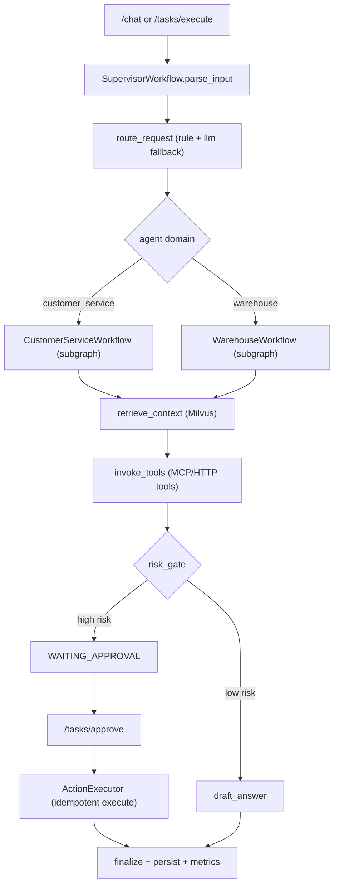

# Tao AI 面试说明文档（思路 + 代码 + 设计）

## 1. 一句话项目定位（开场 20 秒）

Tao AI 是面向陶选到家业务的 Agent Runtime。核心目标是把用户问题从自然语言输入，稳定地走完整条生产链路：路由选 Skill、RAG 拉证据、调用 Java 业务能力、风险审批、动作执行、全链路审计和监控。

技术栈是 LangChain + LangGraph + FastAPI + Ollama + MySQL + Milvus + Prometheus + Grafana。

## 2. 系统整体流程（先讲全局，再讲细节）

### 2.1 请求主链路

1. `POST /chat` 或 `POST /tasks/execute` 进入 Runtime。
2. Supervisor 先做规则路由，规则分不足时由 LLM Router 兜底。
3. 路由到 `customer_service_subgraph` 或 `warehouse_subgraph`。
4. 子图按固定节点执行：`retrieve_context -> invoke_tools -> risk_gate -> draft_answer`。
5. 若命中高风险，则在 `risk_gate` 转入 `WAITING_APPROVAL`。
6. 审批通过后由 `ActionExecutor` 执行落地动作，带幂等键和执行记录。
7. 结果统一回写 MySQL，指标进 Prometheus。

### 2.2 任务状态流转

`NEW -> ROUTED -> RETRIEVING -> TOOL_RUNNING -> WAITING_APPROVAL -> APPROVED -> EXECUTING_APPROVED_ACTION -> COMPLETED`

失败路径：

`ANY -> FAILED`

拒绝路径：

`WAITING_APPROVAL -> REJECTED`

### 2.3 流程图（面试时可口述）



## 3. 四个核心亮点（思路 + 代码 + 设计取舍）

## 3.1 亮点一：Supervisor + 独立子图 SubAgent 架构

### 思路

- 业务域拆分成客服域与仓储域，避免一个大 Agent 混合决策。
- Supervisor 只负责“路由与编排”，子图只负责“领域执行”。
- 子图保留统一节点骨架，保障可观测、可恢复、可插拔。

### 关键代码落点

- Supervisor 主图定义：`app/workflows/supervisor_workflow.py`
- 子图基类：`app/workflows/domain_subworkflow.py`
- 具体子图：`app/workflows/customer_service_workflow.py`、`app/workflows/warehouse_workflow.py`

示例（Supervisor 编排）：

```python
# app/workflows/supervisor_workflow.py
graph.add_node("parse_input", self._parse_input)
graph.add_node("route_request", self._route_request)
graph.add_node("dispatch_customer_subagent", self._dispatch_customer_subagent)
graph.add_node("dispatch_warehouse_subagent", self._dispatch_warehouse_subagent)
graph.add_node("finalize", self._finalize)
```

示例（子图固定执行骨架）：

```python
# app/workflows/domain_subworkflow.py
graph.add_node("retrieve_context", self._retrieve_context)
graph.add_node("invoke_tools", self._invoke_tools)
graph.add_node("risk_gate", self._risk_gate)
graph.add_node("wait_approval", self._wait_approval)
graph.add_node("draft_answer", self._draft_answer)
```

### 设计取舍

- 优点：边界清晰，新增业务域时只要新增 Skill 和子图，不改主流程。
- 风险：跨域流程会增加一次 dispatch 成本。
- 解决：dispatch 统一度量时延，发现瓶颈可做并发或剪枝。

## 3.2 亮点二：MySQL + Milvus 运行时数据底座

### 思路

- MySQL 负责“真相层”：任务、审批、工具轨迹、执行记录可审计。
- Milvus 负责“语义检索层”：FAQ/政策/SOP/规则/历史案例。

### 关键代码落点

- MySQL Schema 与访问层：`app/memory/mysql_store.py`
- Milvus 读写与集合维度守卫：`app/retrieval/milvus_client.py`

示例（tool trace 结构化落库）：

```python
# app/memory/mysql_store.py
INSERT INTO ai_tool_traces(task_id, tool_name, arguments_json, result_preview, result_json, status)
VALUES(%s, %s, %s, %s, %s, %s)
```

示例（Milvus 维度一致性保护）：

```python
# app/retrieval/milvus_client.py
if any(len(vector) != dim for vector in embedding_list):
    raise ValueError("embedding dimension mismatch before insert")
```

### 设计取舍

- 优点：任务真相与检索能力边界清晰，排障时有主键可追踪，有链路可回放。
- 风险：检索质量受向量质量和切片策略影响。
- 解决：维度守卫 + 集合隔离 + rerank，保证召回稳定性。

## 3.3 亮点三：Tool 闭环工程化（审批前拦截 + 审批后执行 + 幂等）

### 思路

- Tool 调用不止“拿结果”，而是完整生命周期：计划动作、审批、执行、审计。
- 高风险 Skill 自动转 `WAITING_APPROVAL`，审批通过后才允许执行落地动作。
- 执行链路自带幂等，避免重复扣减库存/重复退款。

### 关键代码落点

- Tool 调度：`app/tools/mcp_tools/lqzc_tools.py`
- 审批状态写入：`app/tools/approval_tools/approval_tool.py`
- 执行器与幂等：`app/tools/approval_tools/action_executor.py`
- 审批 API 鉴权与状态冲突保护：`app/api/routes_task.py`、`app/workflows/supervisor_workflow.py`

示例（幂等键）：

```python
# app/tools/approval_tools/action_executor.py
source = f"{task_id}|{source_tool}|{payload}"
digest = hashlib.sha256(source.encode("utf-8")).hexdigest()
idempotency_key = f"taoai:{task_id[:12]}:{source_tool}:{digest[:24]}"
```

示例（审批接口鉴权）：

```python
# app/api/routes_task.py
x_approval_token: str | None = Header(default=None, alias="X-Approval-Token")
authorization: str | None = Header(default=None, alias="Authorization")
```

示例（审批状态冲突保护）：

```python
# app/workflows/supervisor_workflow.py
if task.status != TaskStatus.WAITING_APPROVAL:
    raise ValueError("Task status conflict ...")
```

### 设计取舍

- 优点：从“模型建议”升级为“可控执行系统”。
- 风险：审批链路增加时延。
- 解决：异步执行 + 可查询任务状态 + 清晰审计反馈。

## 3.4 亮点四：可观测体系（任务流转 + 性能 + 稳定性）

### 思路

- 把监控目标分三层：业务链路、工作流节点、运行时健康。
- 不只看 QPS，也看“是否卡住”“是否疑似循环”“是否内存增长异常”。

### 关键代码落点

- 指标定义与采集：`app/observability/metrics.py`
- 指标暴露：`app/main.py`（`/metrics`）
- 依赖就绪探针：`app/api/routes_admin.py`（`/ready`）

示例（关键指标）：

```python
# app/observability/metrics.py
taoai_tasks_started_total
taoai_tasks_finished_total
taoai_task_status_transition_total
taoai_workflow_node_duration_seconds
taoai_tool_calls_total
taoai_task_stuck_total
taoai_task_loop_suspect_total
taoai_process_resident_memory_bytes
```

### 设计取舍

- 优点：线上问题定位从“看日志猜原因”变为“看指标定位节点”。
- 风险：指标维度过多会放大存储成本。
- 解决：标签规范化、路径归一化、采样间隔可配置。

## 4. 面试时可直接讲的“代码阅读路线”

1. `app/main.py`：服务入口、路由挂载、`/metrics` 暴露。  
2. `app/workflows/supervisor_workflow.py`：主流程与任务状态机。  
3. `app/workflows/domain_subworkflow.py`：子图节点模板。  
4. `app/skills/registry.py` + `app/agents/supervisor/agent.py`：Skill 路由机制。  
5. `app/tools/mcp_tools/lqzc_tools.py`：Tool 适配与执行入口。  
6. `app/tools/approval_tools/action_executor.py`：审批后动作执行与幂等。  
7. `app/memory/mysql_store.py`：审计数据模型与持久化。  
8. `app/observability/metrics.py`：监控指标与稳定性防护。  

## 5. 高频面试追问（简答模板）

### Q1：为什么选 LangGraph，不直接写普通函数编排？

A：我们需要显式状态机、可中断恢复、节点级观测和审批插入点。LangGraph 在这些点上天然契合企业执行流；普通函数编排在可恢复和可追踪方面代价更高。

### Q2：为什么要做子图，而不是一个大 Agent？

A：业务域差异大。客服和仓储在工具、风险等级、输出契约上都不同。子图能把边界固定下来，降低上下文污染和误调用概率。

### Q3：审批怎么防止越权和重复执行？

A：两层保护。第一层是接口鉴权（`APPROVAL_ADMIN_TOKEN` + Header 校验）。第二层是状态与幂等：只允许 `WAITING_APPROVAL` 审批，执行阶段用 `idempotency_key` 去重。

### Q4：为什么当前没有引入独立缓存层？

A：当前版本优先保证执行闭环和审计一致性，状态真相统一放在 MySQL，避免引入额外一致性复杂度。后续如果并发和吞吐上来，会再按场景引入缓存或消息中间件。

### Q5：如何定位死循环或内存泄漏？

A：监控层有 `task_loop_suspect_total`、`task_stuck_total`、`event_loop_lag_seconds`、`process_rss_bytes`、`python_tracemalloc_bytes`。出现异常先按 task_id 看节点停留，再对照进程指标判断是业务阻塞还是内存增长。

## 6. 面试演示脚本（5 分钟）

1. 发起执行请求：`POST /tasks/execute`。  
2. 展示返回中的 `task_id`、`agent`、`skill`、`tool_events`。  
3. 若命中审批，调用 `POST /tasks/approve`（带 `X-Approval-Token`）。  
4. 查询 `GET /tasks/{task_id}` 看状态转移。  
5. 打开 Grafana 看任务耗时、节点耗时、工具成功率。  
6. 打开 MySQL（`ai_tasks`、`ai_tool_traces`、`ai_approvals`、`ai_action_executions`）验证审计闭环。  

## 7. 你在项目里的角色表述建议（实话高密度版）

我负责把这套 Agent Runtime 从“可跑 Demo”推进到“可上线治理”的工程形态，重点做了三件事：  
一是把执行架构从单体逻辑拆成 Supervisor + 子图，形成清晰状态机；  
二是把 Tool 调用升级为可审批、可幂等、可审计的闭环执行链；  
三是补齐可观测体系，让线上问题可以按任务和节点快速定位。  
